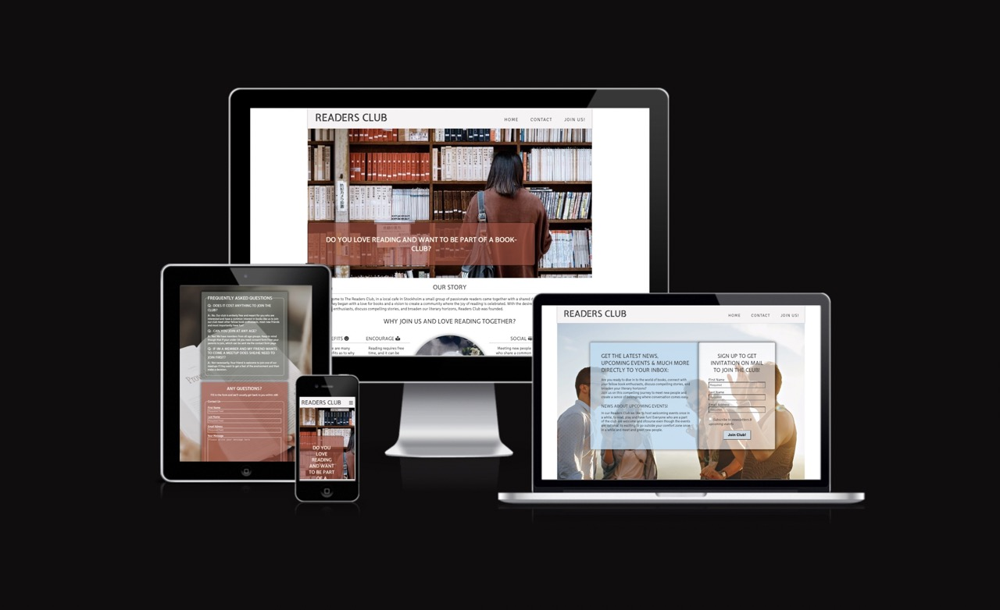
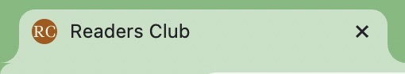
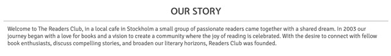
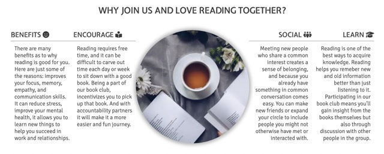
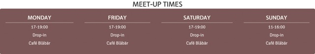
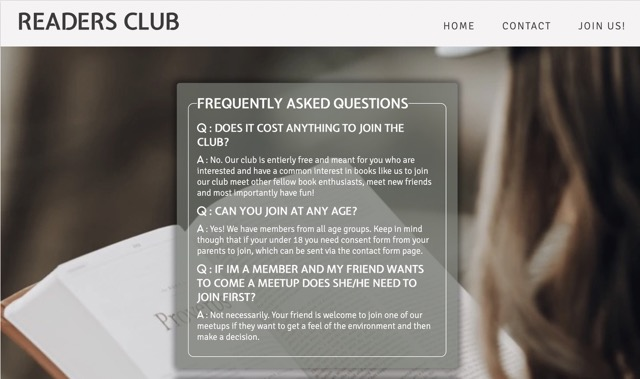
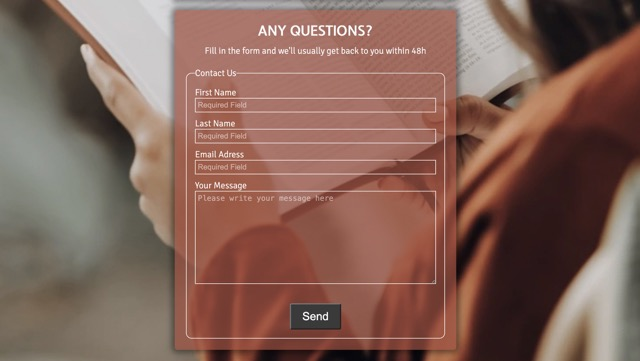
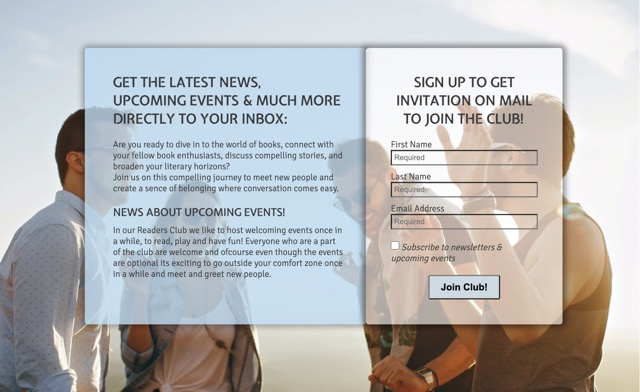
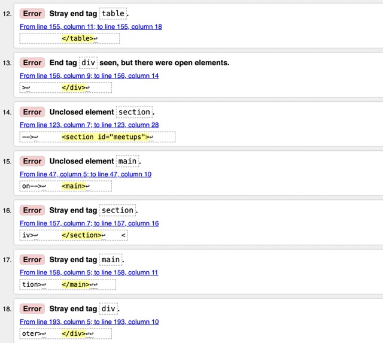
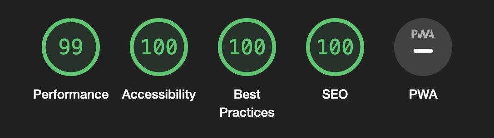

# Readers Club

The Readers Club website is designed for people who love reading books and are looking for a way to socialize and meet other people with the common interest for books and reading in the Stockholm, Sweden area. The website is responsive allowing a visitor to view on a range of different devices.

## Features

The website consists of a home page, a contact page and, a sign up page.

### Existing Features

All pages are responsive and have a :

- Favicon in the browser tab.
  - Is always displayed in the tab no matter where in the website you are.  
    
- Navigation bar.
  - Is displayed on all three pages and is fully responsive with dropdown menu on smaller screen sizes.
  - The responsive navigation bar invludes links to Logo,Home page, Contact page and, Join Us page, making it easy to navigate throughout the website, without having to press the "back" button, on all screen sizes.
    
- Footer
  - Is displayed on all three pages and encourages the user to follow along on the clubs social media pages.
  - All links will open in new tab making it easy for user to not have to press the 'back' button and not causing confusion.
    

#### Landing Page

- The landing page image

  - Exsists of a image with a cover text to encourage the visitor that has an interest in the subject to keep reading and staying on the website.
    

- Our Story Section

  - It shows the user why the club was founded and the desires and vison of the club.
    

- The benefits of club section

  - The visitor will understand the benefits of joining the club and the overall benefit of reading.
  - It will encourage them and see the value in signing up to join the club.
    

- Meetups Section
  - This section allows the visitor to see exactly when, where and how long the meetups will be and that all meetups are a drop-in.
    

#### Contact Page

- Frequently Asked Questions

  - In this part of the page the user will find answers to frequently asked questions.
  - The Frequently asked questions part is put before the contact form on smaller screens so that the user can look through them to see if there question may be answered before considering submitting a question through the form.
    

- Contact Form
  - In this part the visitor who may have questions will be able to submit this through the form. All parts are required and in the email input the form cannot be submitted if a @ is not present. And the submit button also works.
    

#### Join Us Page

- Sign Up form & brief overwiev of why to join

  - In this section of the page the visitor is presented with a join-us form and a overwiev of why they should sign up to join and the benefits.
  - The section is fully resposive and has the sign up form put above the overwiev on smaller screens and beside eachother on bigger screens so that the visitor may go over the values of joining on last time to raise excitement.
  - The form inputs are all required, has a checkbox for those who wants to recieve newsletters & updates, and a working join button.

  

### Features Left to Implement

- In future implementations I would like to:

  - Add a community page that describes more about the members of the club with pictures.
  - A benefit how joining the club gets you access to a group on Telegram (messaging app) to communicate and get to know new and existing members.

## Testing

### Validator Testing

- HTML
  - Errors where returned when passing through the official [WC3 validator.](https://validator.w3.org/nu/?doc=https%3A%2F%2Fdilaraucar.github.io%2Fbook-club%2F)
    
- CSS
  - No errors where found when passing through the official [jigsaw validator.](https://jigsaw.w3.org/css-validator/validator?uri=https%3A%2F%2Fdilaraucar.github.io%2Fbook-club%2F&profile=css3svg&usermedium=all&warning=1&vextwarning=&lang=sv)
- Accessability

  - I confirmes that all colour and fonts chosen are easy to read and accessable by running it through lighthouse in chrome devtools.

  

### Unfixed Bugs

## Deployment

## Credits

### Content

### Media

## Other General Project Advice
