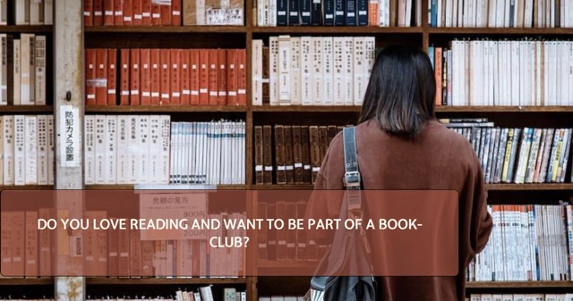

# Readers Club

The Readers Club website is designed for people who love reading books and are looking for a way to socialize and meet other people with the common interest for books and reading in the Stockholm, Sweden area. The website is responsive allowing a visitor to view on a range of different devices. This site is targeted for anyone who likes reading books and wants to feel a sence of belonging to a community with common interests.

Users of the website will be able to find all the information they need to know about Readers Club, such as a home page with information about why the club was founded, the benefits of the club, meeting times, a contact page with FAQ's and a signup page.

## Features

The website consists of a **Home page**, a **Contact page** and, a **Sign-Up page.**

All pages are responsive and have a :

- Favicon in the browser tab.

  - Is always displayed in the tab no matter where in the website you are.  
    

- Navigation

  - Is displayed on all three pages and is fully responsive with the logo to the left and navigation links to the right on bigger screens and with dropdown menu on smaller screen sizes.

  - The navigation links includes links to Logo,Home page, Contact page and, Join Us page, making it easy to navigate throughout the website, without having to press the "back" button, on all screen sizes.

    

- Footer

  - Is displayed on all three pages and encourages the user to follow along on the clubs social media pages.

  - All links will open in new tab making it easy for user to not have to press the 'back' button and not causing confusion.

    

#### Landing Page

- The landing page image

  - Exsists of a image with a cover text to encourage the visitor that has an interest in the subject to keep reading and staying on the website.

    

- Our Story Section

  - It shows the user why the club was founded and the desires and vison of the club.

    

- The benefits of club section

  - The visitor will understand the benefits of joining the club and the overall benefit of reading.

  - It will encourage them and see the value in signing up to join the club.

    

- Meetups Section

  - This section allows the visitor to see exactly when, where and how long the meetups will be and that all meetups are a drop-in.

    

#### Contact Page

- Frequently Asked Questions

  - In this part of the page the user will find answers to frequently asked questions.

  - The Frequently asked questions part is put before the contact form on smaller screens so that the user can look through them to see if there question may be answered before considering submitting a question through the form.

    

- Contact Form

  - In this part the visitor who may have questions will be able to submit this through the form. All parts are required and in the email input the form cannot be submitted if a @ is not present. And the submit button also works.

    

#### Join Us Page

- Sign Up form & brief overwiev of why to join

  - In this section of the page the visitor is presented with a join-us form and a overwiev of why they should sign up to join and the benefits.

  - The section is fully resposive and has the sign up form put above the overwiev on smaller screens and beside eachother on bigger screens so that the visitor may go over the values of joining on last time to raise excitement.

  - The form inputs are all required, has a checkbox for those who wants to recieve newsletters & updates, and a working join button.

  

### Features Left to Implement

- In future implementations I would like to:

  - Add a community page that describes more about the members of the club with pictures.

  - A benefit how joining the club gets you access to a group on Telegram (messaging app) to communicate and get to know new and existing members.

## Testing

- I have confirmed that this project is responsive and looks good on all screen sizes using the Chrome devtool.
- I have tested that this page works in different browsers: Chrome, Safari.
- I have confirmed that all forms work on the website: requires entries in every field, only accepts email in the email field and working buttons.

### Validator Testing

- HTML

  - Errors where returned when passing through the official [WC3 validator.](https://validator.w3.org/nu/?doc=https%3A%2F%2Fdilaraucar.github.io%2Fbook-club%2F)

  - When all of these errors where corrected the HTML passed the validation when tested again.

    

- CSS

  - No errors where found when passing through the official [jigsaw validator.](https://jigsaw.w3.org/css-validator/validator?uri=https%3A%2F%2Fdilaraucar.github.io%2Fbook-club%2F&profile=css3svg&usermedium=all&warning=1&vextwarning=&lang=sv)

- Accessability

  - I confirmes that all colour and fonts chosen are easy to read and accessable by running it through lighthouse in chrome devtools.

  

## Fixed Bugs

In contact page the footer did not go to the bottom of the page on all screen sizes. I fixed this by adding a div around the content of the page and gave it a height of 100vh.

## Deployment

The site was deployed to GitHub pages. The steps to deploy are as follows:

1. Go to [Book-Club repository](https://github.com/DilaraUcar/book-club)
2. Navigate to the Settings, top left
3. In settings on the left side of the screen click pages.
4. From the source section drop-down menu, select the Deploy from branch.
5. Under Branch select main and set folder to root and save.
6. once the steps are done go back to book club repository and refresh page and you'll see deployed page at the right side if you scroll down.

The live link can be found here - <https://dilaraucar.github.io/book-club/index.html>

## Credits

### Code that was used

- Navigation - dropdown toggle for mobile screens where inspired from Code Institutes Love Running project.

  

- Footer - the socials for footer where inspired from Code Institutes Love Running project.

  

### Content

- The text on home page was taken and inspired from this [blog post.](https://blog.everand.com/reasons-to-join-a-book-club/)
- How to change placeholder text on forms where taken from [this site.](https://www.w3schools.com/howto/howto_css_placeholder.asp)

### Media

- [Font Awesome](https://fontawesome.com/sessions/sign-in) were used for all icons such as in the footer, the benefits section and q&a section in contact page.
- [Favicon.io](https://favicon.io/favicon-generator/) were used to create and generate a favicon.
- [Coolors](https://coolors.co/6f756c-9a9a92-23191a-562d25-080a0e-19181a) were used to generate different colour palettes to use on website.
- [Pexels](https://www.pexels.com/sv-se/) were used for all images used.
- [Fontjoy](https://fontjoy.com/) were used to generate font pairings that look good together.
